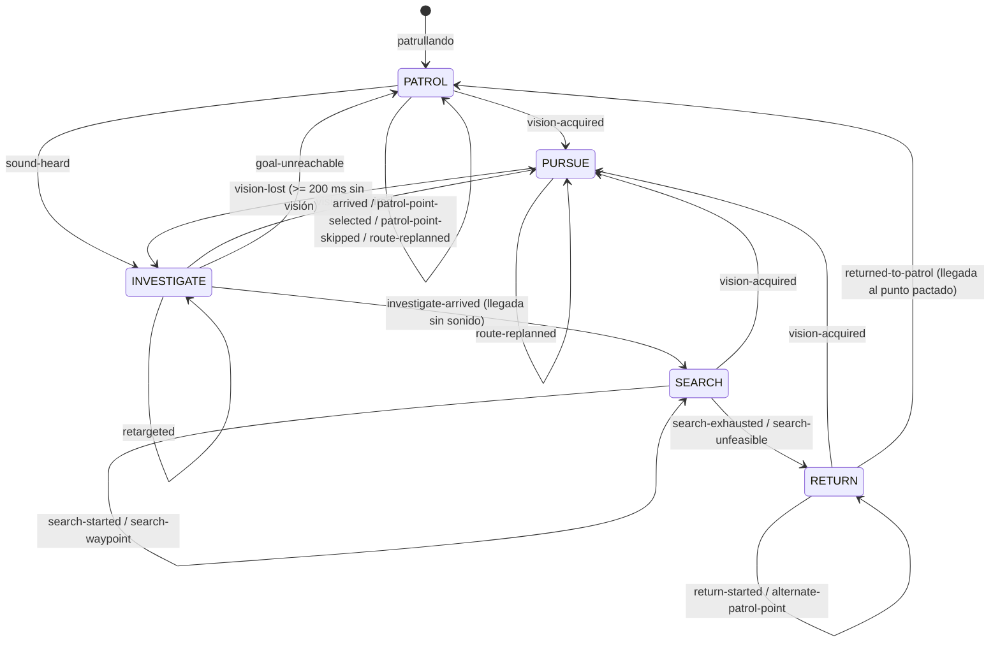

# Comparación de arquitecturas de decisión del guardia

## Propósito

H5 documenta y justifica la arquitectura de comportamiento implementada en H4.1–H4.5. La comparación no describe un sistema hipotético: describe el comportamiento real validado por las 106 pruebas del repositorio y lo contrasta con cómo se expresaría ese mismo comportamiento con un árbol de comportamiento (BT), utilidad (Utility AI) y GOAP.

Este documento no implementa ni instala ninguna de las alternativas. La conclusión es válida sólo para el problema y alcance de este laboratorio.

## 1. La máquina de estados real implementada

La decisión vive en el dominio puro:

- `src/domain/behavior/guardState.ts` define `GuardState`, `GuardCause`, `GuardPerceptionInput`, `GuardTransitionContext` y la función pura `resolveTransition(state, perception, context)`. No importa Phaser, DOM ni navegador.
- `src/application/simulation/guardSimulation.ts` coordina la FSM con la navegación A*, el plan de búsqueda y el orden de retorno; emite la telemetría real.
- `src/domain/telemetry/transitionLog.ts` conserva eventos `{ timeMs, from, to, cause, target }` con cola de 10 (`LOG_TAIL_LIMIT`).
- `src/game/scenes/GameScene.ts` sólo presenta el estado y la telemetría en el HUD.

### Estados reales

| Estado | Etiqueta de la escena | Significado |
|---|---|---|
| `patrol` | PATRULLANDO | Recorre los puntos de patrulla en ciclo |
| `investigate` | INVESTIGANDO | Se dirige a la última posición conocida |
| `pursue` | PERSIGUIENDO | Sigue la posición visible del jugador |
| `search` | BUSCANDO | Recorre un plan finito alrededor del LKP |
| `return` | REGRESANDO | Vuelve a un punto de patrulla tras agotar la búsqueda |

### Transiciones y causas reales

| Desde | Hacia | Causa | Condición implementada |
|---|---|---|---|
| `patrol` | `pursue` | `vision-acquired` | visión válida |
| `patrol` | `investigate` | `sound-heard` | sonido, sin visión |
| `investigate` | `pursue` | `vision-acquired` | visión válida |
| `investigate` | `patrol` | `goal-unreachable` | LKP inaccesible (recuperación en el coordinador) |
| `investigate` | `search` | `investigate-arrived` | llegada al LKP sin sonido |
| `pursue` | `investigate` | `vision-lost` | sin visión durante al menos 200 ms (`VISION_LOST_GRACE_MS`) |
| `search` | `pursue` | `vision-acquired` | visión válida |
| `search` | `return` | `search-exhausted` | plan cubierto o presupuesto de 5000 ms (`SEARCH_DURATION_MS`) |
| `search` | `return` | `search-unfeasible` | plan vacío o tramo inviable |
| `return` | `pursue` | `vision-acquired` | visión válida |
| `return` | `patrol` | `returned-to-patrol` | llegada a un punto de patrulla pactado |

Existen además eventos de bucle propio que no cambian de estado: `patrol-started`, `arrived`, `patrol-point-selected`, `patrol-point-skipped`, `route-replanned`, `retargeted`, `search-started`, `search-waypoint`, `return-started` y `alternate-patrol-point`. La causa `investigate-target` está declarada en `GuardCause` pero ninguna transición la emite.

### Parámetros reales

| Parámetro | Valor | Ubicación |
|---|---|---|
| `VISION_LOST_GRACE_MS` | 200 | `src/domain/behavior/guardState.ts` |
| `REPLAN_INTERVAL_MS` | 250 | `src/application/simulation/guardSimulation.ts` |
| `SEARCH_RADIUS_CELLS` | 3 | `src/application/simulation/guardSimulation.ts` |
| `SEARCH_WAYPOINTS_MAX` | 16 | `src/application/simulation/guardSimulation.ts` |
| `SEARCH_DURATION_MS` | 5000 | `src/application/simulation/guardSimulation.ts` |
| `LOG_TAIL_LIMIT` | 10 | `src/application/simulation/guardSimulation.ts` |
| Puntos de patrulla | `(27,17),(2,17),(2,4),(27,4)` | `src/application/simulation/labLevel.ts` |

### Prioridad visión > sonido

Se codifica por orden de evaluación en `resolveTransition`: cada estado evalúa primero `visionVisible` y, sólo si no hay visión, considera sonido o condiciones de contexto. La memoria (`src/domain/perception/memory.ts`) aplica la misma prioridad: ante observaciones simultáneas, la visión conserva la posición conocida (`rememberObservation`).

## 2. Diagrama de la FSM real



Los lazos con nombre propio no cambian de estado; registran avances dentro del estado (selección de punto, replanificación, waypoints, candidatos).

## 3. Trace representativo

El trace siguiente es el resultado real del test de traza agregado en `tests/application/guardSimulation.test.ts` sobre `LAB_MAP` y `PATROL_POINTS` reales. Causa la secuencia pedida:

`PATROL → INVESTIGATE → PURSUE → INVESTIGATE → SEARCH → RETURN → PATROL`

| t (ms) | Posición del guardia | Estado resultante | Causas emitidas |
|---|---|---|---|
| 0 | `(27,17)` | `patrol` | `patrol-started`, `route-replanned` →
| 100 | `(27,17)` | `investigate` | `sound-heard`, `retargeted` → (LKP `(6,17)`) |
| 200 | `(6,17)` llegada | `search` | `investigate-arrived`, `search-started` |
| 300 | `(6,17)` | `pursue` | `vision-acquired`, `route-replanned` → (LKP `(20,18)`) |
| 500 | `(20,18)` | `investigate` | `vision-lost`, `retargeted` |
| 600 | `(20,18)` llegada | `search` | `investigate-arrived`, `search-started` |
| 5600 | `(20,18)` | `return` | `search-exhausted`, `return-started` → (candidato `(27,17)`) |
| 5800 | `(27,17)` llegada | `patrol` | `returned-to-patrol`, `route-replanned` → (siguiente punto `(2,17)`) |

Lista de causas exacta que valida el test:

```text
patrol-started, route-replanned,
sound-heard, retargeted,
investigate-arrived, search-started,
vision-acquired, route-replanned,
vision-lost, retargeted,
investigate-arrived, search-started,
search-exhausted, return-started,
returned-to-patrol, route-replanned
```

En el retorno, los candidatos se ordenan por distancia Manhattan desde la posición del guardia al entrar en RETURN (`orderedReturnCandidates`); desde `(20,18)` el orden real es `(27,17)`, `(2,17)`, `(27,4)`, `(2,4)`.

## 4. Tabla comparativa

| Aspecto | FSM (implementada) | Behavior Tree | Utility AI | GOAP |
|---|---|---|---|---|
| Representación de estados y transiciones | Estados explícitos y transiciones declaradas; decisión local por estado | Sin estados explícitos: nodos + ticks; la prioridad la da el orden de los selectores | Sin nodos de estado: conjunto de acciones puntuadas | Sin estado de "ahora": búsqueda de plan hacia metas |
| Complejidad de la lógica actual | 5 estados, 11 transiciones, 19 causas declaradas; tabla completa en el documento | El mismo árbol tendría ~15-20 nodos (selector raíz, ramas por estado, decoradores de memoria) | Curvas y pesos por acción más una capa de selección; más piezas de ajuste | Planificador + modelo de acciones con precondiciones/efectos; mayor superficie de código |
| Percepción y prioridad visión > sonido | Orden de evaluación explícito y visible en `resolveTransition` | Selector con rama de visión primero; sugerente y similar | Se expresa por pesos de utilidad, no está estructurada | Se deduce de metas/precondiciones; la prioridad no es un orden visible |
| PATROL | Bucle por `patrol-point-selected`/`arrived`; salto de puntos inaccesibles | Secuencia en un nodo `patrol` con selector/secuencia y memoria | Acción "patrullar" con utilidad base; requiere vigilar que no compita con otras | Meta de patrulla con plan a cada punto; planificar el ciclo completo es excesivo |
| INVESTIGATE | Estado con destino LKP y retarget por nuevo sonido | Nodo de investigar con secuencial: ir a LKP, buscar | Acción puntuada por sonido/LKP reciente | Meta "conocer LKP" con plan de ir y observar |
| PURSUE | `vision-acquired` desde cualquier estado; grace de 200 ms | Ramas de pursue en el selector raíz; el grace requiere decorador | Acción con utilidad alta mientras hay visión | Meta de persecución replanificada; requiere atenuar dispersión de paths |
| SEARCH | Plan finito prefijado (radio 3, máximo 16) con presupuesto | secuencia con memoria (visit dependiente del estado) | Acción con utilidad que decae al expandirse | Serie de metas de recoger celdas; plan para cada waypoint |
| RETURN | Candidatos ordenados por Manhattan, alternancia ante inaccesible | Ramas de retorno con política de re-selección | Acción que gana utilidad cuando la búsqueda agota | Meta "estar en un punto patrullable" con alternativas |
| Memoria / LKP | Memoria externa (dominio) nunca borrada; el estado la consulta | Estado externo compartido igual; los nodos la consultan por frame | Estado externo compartido; más `getters` de estado en puntuadores | Estado del mundo parcial; el planificador lo lee en precondiciones |
| Replanning | Sólo cuando cambia la celda objetivo o vence `REPLAN_INTERVAL_MS` | El tick re-evalúa el árbol cada frame; la frecuencia se controla con `Timer`/decorador | Se re-puntúa cada frame; presión de CPU y necesidad de control de frecuencia | El planificador corre cuando algo cambia; hay que acotar la frecuencia |
| Condiciones de entrada/salida | Guardas locales por estado, legibles en un solo archivo | Guardas en ramas; el flujo transversal está disperso | Criterios de utilidad por acción; entrada/salida implícitas | Precondiciones/efectos por acción; el "cuándo" está en el planificador |
| Trazabilidad / telemetría | Causas reales con `timeMs`, `from`, `to`, `target`; cola de 10 | Registro de nodos/ticks; sin causas de transición natural | Sin causa única: la decisión es un ranking de puntuación | Registro de plans/acciones, no una causa de transición |
| Facilidad de prueba | `resolveTransition` es pura; 106 pruebas incluyen secuencias enteras | Pruebas por nodo y por integración de árboles; estado del tick extra | Difícil aislar la decisión sin congelar los puntuadores | Pruebas del planificador y de las acciones; mayor superficie |
| Facilidad de extensión | Agregar estado = 1 rama + causas; crecer mucho degrada al agregar estados | Agregar ramas/nodos es mecánico y de bajo riesgo | Ajustar pesos es cómodo para matices | Extender acciones/metas es potente para combinaciones nuevas |
| Previsibilidad / determinismo | Secuencia exacta y reproducible (sin azar; tiempo inyectado) | Determinista si es puro, pero el tick re-evalúa y puede "olvidar" progreso sin decoradores | Determinista si es puro, pero el resultado es un ranking sensible a pesos | Determinista por hillclimbing pero exploración/heurística puede variar |
| Adecuación al problema del proyecto | Alta: repertorio fijo y pequeño, requisitos de legibilidad, justicia y trazabilidad | Media-alta: natural para prioridades, con más nodos y gestión de memoria | Media: buena para trade-offs, excesiva para 5 conductas fijas | Baja-media: generalista para metas diversas; mucho coste para este caso |

## 5. Cómo se expresaría el mismo comportamiento en cada alternativa

### Árbol de comportamiento (BT)

Un selector raíz daría prioridad por orden de ramas:

```text
Selector raíz
  ├─ PURSUE:    visión visible (secuencia: perseguir LKP, mantener ruta)
  ├─ INVESTIGATE: sonido o LKP reciente (secuencia: ir a LKP, buscar brevemente)
  ├─ SEARCH:    plan finito alrededor del LKP (secuencia con decorador de visitados)
  ├─ RETURN:    puntos de patrulla por Manhattan (secuencia con política de salto)
  └─ PATROL:    bucle por puntos cíclicos (secuencia con memoria)
```

El progreso de SEARCH y RETURN, que hoy es estado persistente (`planIndex`, `candidateIndex`), requeriría nodos con memoria (decoradores de tipo *memorized sequence*) para no reiniciar en cada tick. La trazabilidad pasaría de "causas de transición" a registros de nodos activos.

### Utility AI

Cada acción puntuaría con funciones de utilidad:

- `perseguir`: utilidad alta con visión, decae sin visión.
- `investigar`: utilidad media con sonido/LKP reciente.
- `buscar`: utilidad media que decae a medida que se expande el plan.
- `regresar`: utilidad creciente tras agotar la búsqueda.
- `patrullar`: utilidad base de respaldo.

Estas utilidades deben forzar la prioridad fija "visión > sonido" con pesos separados; sin ese cuidado, un sonido reciente podría puntuar más que una visión y romper la prioridad garantizada hoy por la FSM.

La ventaja sería ajustar matices con pesos; el coste: la conducta deja de enumerarse como transiciones y se vuelve un ranking opaco para el estudiante, con más parámetros que sintonizar.

### GOAP

Un planificador con acciones de precondiciones/efectos:

- `moverse_a(pose)` con efecto `En(Pose)`.
- `observar(lugar)` con precondición `En(lugar)` y efecto `Conocido(lugar)`.
- `detectar_jugador` con efecto `SabePosicion(J)`.

Para el mismo comportamiento habría que definir metas ("mantener patrulla", "alcanzar LKP", "no perder al jugador") y dejar que el planificador encadene acciones. El ejemplo de 8 frames de la sección 3 se convertiría en varios planes independientes, y la predictibilidad de la secuencia exacta (central en las pruebas de H4) dejaría de estar garantizada por construcción.

## 6. Justificación técnica

### Hechos observables del proyecto

- El repertorio de conductas es fijo y pequeño: 5 estados y 11 transiciones en `resolveTransition`.
- Existe una prioridad estática y constante: visión > sonido.
- La secuencia completa es determinista y reproducible (tiempo inyectado por cuadro; sin aleatoriedad).
- La navegación (A*), la percepción, la memoria y el seguidor de caminos ya existen y no deciden conducta; la FSM sólo decide transiciones.
- El laboratorio exige trazabilidad (`hitos.md`: "Registro de transiciones") y legibilidad/justicia (H5: "lectura y justicia").
- Las pruebas automatizadas son el mecanismo de aceptación: 106 pruebas en 11 archivos, incluidas secuencias de estados completas.
- RA7 del `specs/02-pedagogica.md` pide "implementar al menos A* y FSM" y RA11 pide documentar y defender la decisión; la comparación es un requisito pedagógico explícito.

### Características generales de cada arquitectura

- **FSM**: estados y transiciones explícitos; determinista; prioridad por orden; simple de razonar para repertorios moderados; pierde legibilidad si el número de estados crece.
- **Behavior Tree**: re-evaluación por tick, prioridad por orden de ramas, reutilización de subárboles; requiere nodos con memoria para conservar progreso.
- **Utility AI**: adecuado para compensaciones continuas y decisiones por puntuación; más parámetros y una decisión menos declarativa.
- **GOAP**: generalista y orientado a metas; flexibilidad para combinar acciones; planificador, precondiciones y efectos constituyen un coste mayor.

### Inferencias y conclusiones técnicas

- Para un repertorio fijo de 5 conductas con una única prioridad estática, la FSM expresa el comportamiento con menos piezas que BT, Utility o GOAP (las alternativas agregan nodos con memoria, curvas o un planificador sin aportar capacidades nuevas para este caso).
- La función de transición pura (`resolveTransition`) hace la decisión directamente comprobable: los mismos tests que aceptan H4 son la evidencia del trace de la sección 3. Con BT/Utility/GOAP, aislar "el momento exacto" de cambio de conducta exige instrumentación adicional.
- El determinismo por construcción sostiene las condiciones de "legibilidad y justicia" del laboratorio: un jugador puede predecir y explicar la conducta.
- La trazabilidad con causas con nombre (no con rankings) es coherente con el requisito de "Registro de transiciones".
- Límite de la conclusión: si el laboratorio creciera a conductas variadas, múltiples agentes o decisiones de compromiso, BT (por composición) o Utility (por matices) podrían escalar mejor; esa apreciación es una intuición fuera del alcance actual y no se ha demostrado aquí.

Conclusión acotada a este proyecto: para el problema real implementado, la FSM es la arquitectura adecuada porque minimiza la complejidad, garantiza determinismo y trazabilidad y es educativamente coherente con los resultados de aprendizaje. Esta conclusión no afirma superioridad universal de la FSM.

## Límites y riesgos del documento

- La causa `investigate-target` está declarada en `GuardCause` pero no se emite; el documento la reporta como tal, sin ocultarla.
- El gate de llegada de RETURN (`arrived && route !== null`) es una decisión del coordinador, no de la FSM; el diagrama y la tabla lo reflejan.
- No existe automatización de navegador: las trazas provienen de la simulación Node probada, no de una sesión visual; la interacción visual sigue fuera de cobertura automatizada.